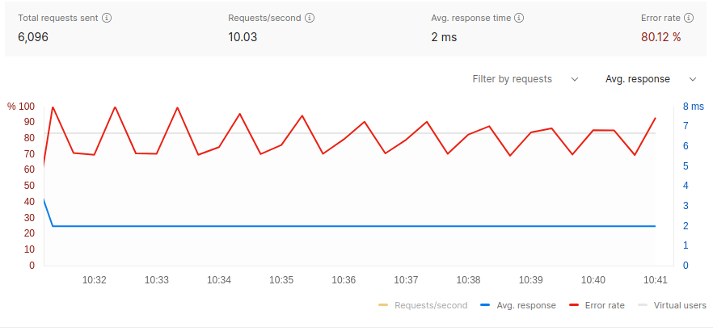
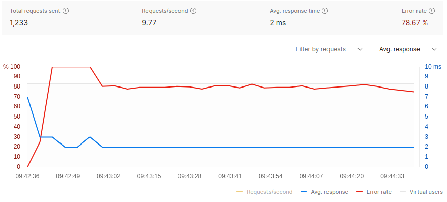

A Rate Limiter in Go!
-----

Rate limiters are used to throttle traffic to any given endpoint to prevent misuse and ensure the endpoint resources are fairly distributed among its users.

This project is an attempt to build a rate limiter in Go! Following rate limiting algorithms are supported:

- Token Bucket
- Fixed Window
- Sliding Window
- Sliding Window Counter

This rate limiter opens an HTTP port at 8080 and provides two endpoints:

- `/unlimted`
- `/limited`


There is no rate limiting on `/unlimited`, while the `/limited` endpoint applies rate limiting per ip based on one of the supported algorithms.

How to run?
---

Clone the project, and cd into `ratelimiter`. To launch the ratelimiter you can run:

```
go run main.go -limiterAlgo=slidingwindow
```

Responses on the available endpoints:
```
$curl http://127.0.0.1:8080/limited
Limited, don't over use me!
```

```
curl http://127.0.0.1:8080/unlimited
Unlimited! Let's Go!
```

Performance
---

[Postman](https://www.postman.com/) was used to measure performance of this rate limiter. 

For sliding window algorithm, with 60 requests allowed per 30 sec window, with 10 virtual users:



As expected the error rate hovers around 80% as roughly 2 req/sec are allowed, while 10 req/sec are received.

Response of a sliding window counter algorithm with same limits:



Code Internals
---

#### main.go

This file declares an interface of a rate limiter:
```
type rateLimiter interface {
	LimitExceeded(ip string) bool
}
```

Each algorithm used in this project implements this interface. 

#### ~algorithm~.go 

These files contain the logic for respective rate limiting algorithms. Note that all implementations are thread safe. 

References
---

- https://codingchallenges.fyi/challenges/challenge-rate-limiter/
- https://blog.cloudflare.com/counting-things-a-lot-of-different-things/

